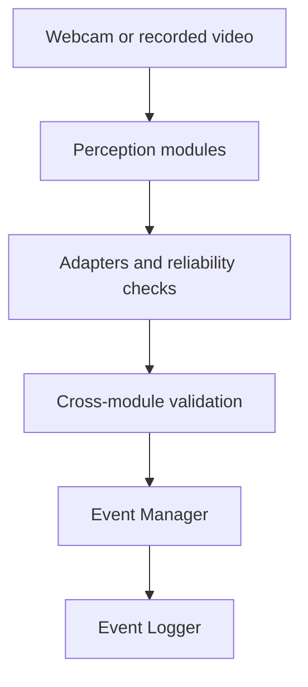

# Computer Vision Component

## Overview

This folder contains the webcam-based Computer Vision component of an
online-assessment monitoring prototype. It detects and records observable
visual cues that may require later human review.

The component does **not** determine whether an examinee is cheating, assign
guilt, calculate a cheating score, or make disciplinary decisions. Its outputs
must be interpreted together with timing, confidence, reliability, concurrent
cues, and the limitations of the prototype.

## Architecture

The component contains three perception modules:

1. **Person and object-cue detection**
2. **Head-pose estimation**
3. **Eye-gaze estimation**

Their frame-level outputs are normalized by adapters and checked by
cross-module validation. Eligible sustained cues are then converted into
structured `START`-`ACTIVE`-`END` events and written to traceable logs.



The Event Manager and Event Logger are integration components, not additional
perception modules.

## Perception Modules

### Person and Object-Cue Detection

The current detector is initialized from `yolov8s-oiv7.pt`, an OIV7-pretrained
YOLOv8s checkpoint, and fine-tuned on OIV7-Anchor Dataset V3.

The selected global integration checkpoint is `original_5e_best.pt`. The base
inference configuration uses a confidence threshold of `0.25`, an input size of
`640`, and an IoU threshold of `0.45`.

The detector and integration adapter use the following interface:

| Model label | Integration label | Meaning |
| --- | --- | --- |
| `person` | `person` | Examinee or another visible person |
| `phone` | `phone` | Mobile phone |
| `laptop` | `computer_device` | Current laptop-related cue |
| `book_notes` | `book_notes` | Book, paper, or notes |
| `calculator` | `calculator` | Calculator |
| `watch` | `watch` | Wristwatch or similar watch |
| `audio_device` | `audio_device` | Headphones, headsets, wired earphones, or earbuds |

`computer_device` is the integration-facing name mapped from the trained
`laptop` class. The current model must not be described as a validated general
detector for monitors or all computer equipment.

### Head-Pose Estimation

The head-pose module uses MediaPipe Face Mesh landmarks, a Canonical 14-point
2D-3D correspondence configuration, and OpenCV `solvePnP`. A session-level
neutral baseline is used to expose calibrated directional cues such as
`HEAD_LEFT`, `HEAD_RIGHT`, `HEAD_UP`, and `HEAD_DOWN`.

### Eye-Gaze Estimation

The gaze module uses L2CS-Net with session-level centre-gaze calibration and
MediaPipe-based eye-reliability checks. It estimates coarse centre, left,
right, up, and down directions rather than a precise screen coordinate.

Gaze-output availability is kept separate from gaze-event eligibility. Blink,
eye closure, one-eye unavailability, profile views, uncertain landmarks, and
head orientation can therefore suppress an unreliable independent gaze event
while preserving useful diagnostic context.

## Integration and Event Outputs

The integration layer includes:

- normalized YOLO and head/gaze adapters;
- asynchronous latest-frame YOLO inference;
- cross-module validation;
- confidence, reliability, and cue-eligibility checks;
- temporal event confirmation, release grace, and cooldown handling; and
- JSONL, CSV, and session-summary logging.

The conservative `audio_device` event rule uses:

| Parameter | Value |
| --- | ---: |
| Event-eligibility confidence | `0.43` |
| Minimum duration | `0.75 s` |
| Release grace | `0.60 s` |
| Cooldown | `0.50 s` |

Detailed module-specific rules should be maintained in configuration and
methodology documents rather than duplicated throughout the repository.

## Repository Structure

```text
computer_vision/
├── src/            # Reviewed runtime and module code
├── evaluation/     # Evaluation scripts, protocols, and templates
├── configs/        # Shareable runtime and evaluation configuration
├── environments/   # Reproducible environment specifications
├── docs/           # Scope, architecture, dataset, method, and handover docs
├── results/        # Selected reviewed and anonymized evidence
├── models/         # Model registry, model cards, and access instructions
├── tests/          # Automated checks and smoke tests
├── .gitignore      # Computer-Vision-specific exclusions
└── README.md       # This overview
```

The folders are being populated progressively as canonical files are reviewed,
cleaned, and verified.

## Current Status

Implemented and tested:

- the three perception modules;
- standardized YOLO and head/gaze interfaces;
- reliability-aware gaze-event eligibility;
- selected cross-module validation rules;
- asynchronous YOLO inference;
- temporal event management; and
- structured event logging.

Current handover work:

- structured end-to-end event evaluation;
- event-level failure analysis and result summaries;
- canonical source-code selection and path cleanup;
- environment and configuration verification;
- model packaging and access instructions; and
- final reproducibility and handover checks.

## Documentation

- [Project scope](docs/project_scope.md)
- [Module overview](docs/module_overview.md)
- [Object-detection class mapping](docs/datasets/class_mapping.md)
- [Dataset sources and final V3 composition](docs/datasets/dataset_sources.md)

Evaluation protocols, configuration references, model documentation, and
limitations will be linked here after their canonical versions are added.

## Setup and Usage

The canonical environment specification, checkpoint access instructions, and
runtime commands are being verified before publication. They will be added to
`environments/`, `models/`, and this section after the corresponding canonical
files have been tested from a clean setup.

Do not rely on historical experimental commands or machine-specific absolute
paths as final reproduction instructions.

## Data, Models, and Privacy

This repository does not include:

- raw or redistributed source datasets;
- identifiable private webcam images or recordings;
- complete local Conda environments;
- temporary outputs, logs, or training runs;
- redundant or unreviewed checkpoints;
- credentials or machine-specific private configuration; or
- duplicated third-party repositories and model files.

Dataset provenance and class mappings are documented under `docs/datasets/`.
Where a model cannot be redistributed, the repository should provide its
source, version, integrity information where available, and access
instructions. Selected results must be reviewed and anonymized before upload.

## Responsible Use

Every detection or event is a review cue, not proof of intent. Legitimate
behaviour, camera angle, lighting, occlusion, participant differences, model
errors, and dataset limitations can all affect the output. Any interpretation
must retain human review and the contextual evidence recorded by the system.
