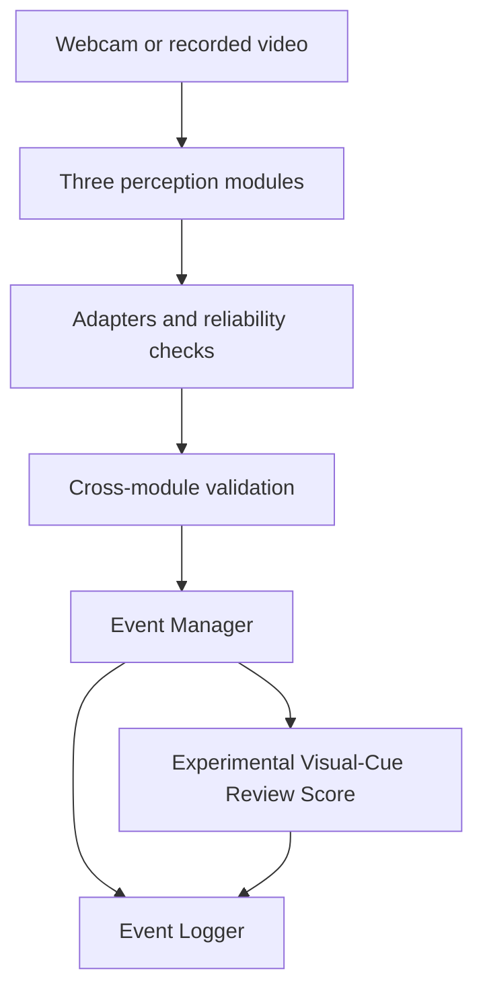

# Computer Vision Component

## Overview

This folder contains the webcam-based Computer Vision component of an
online-assessment monitoring prototype. It detects observable visual cues,
converts sustained eligible observations into structured events, and records
traceable evidence for later human review.

The component does **not** determine whether an examinee is cheating, assign
guilt, or make disciplinary decisions. The Experimental Visual-Cue Review
Score is a transparent prioritisation aid, not a calibrated probability or an
automatic verdict.

## Architecture

The component contains three perception modules:

1. **Person and object-cue detection**
2. **Head-pose estimation**
3. **Eye-gaze estimation**

Their outputs are normalized by adapters, checked for reliability and selected
cross-module contradictions, converted into `START`-`ACTIVE`-`END` events, and
written to structured logs. A configurable review score can summarise the
currently active eligible cues without replacing their underlying evidence.



The Event Manager, Event Logger, and review-score module are integration
components, not additional perception modules.

## Frozen Runtime Baseline

- Object detector: OIV7-pretrained YOLOv8s fine-tuned on OIV7-Anchor Dataset V3
- Selected checkpoint: `original_5e_best.pt`
- YOLO settings: confidence `0.25`, image size `640`, IoU `0.45`, CPU,
  asynchronous latest-frame inference
- Head pose: MediaPipe landmarks, Canonical 14 geometry, and OpenCV `solvePnP`
- Gaze: L2CS-Net with session calibration and MediaPipe eye-reliability checks
- Audio-device event rule: confidence `0.43`, minimum duration `0.75 s`, release
  grace `0.60 s`, cooldown `0.50 s`
- Review-score configuration: `configs/multi_cue_review_score_v1_1.json`

The detector's trained `laptop` class is exposed as `computer_device`. This is
an integration label; the current checkpoint is not a validated general
detector for monitors or all computer equipment.

## Repository Structure

```text
computer_vision/
├── configs/        # Shareable runtime configuration
├── docs/           # Scope, architecture, dataset, and handover documentation
├── environments/   # Reproducible environment specification
├── evaluation/     # Evaluation guidance, protocols, and templates
├── models/         # Model registry and download/integrity instructions
├── resources/      # Small tracked runtime resources
├── src/            # Frozen integration runtime
├── tests/          # Synthetic integration checks
├── .gitignore      # Computer-Vision-specific exclusions
└── README.md       # This overview
```

Runtime model binaries, the external L2CS-Net checkout, private media, and raw
session outputs are intentionally excluded from ordinary Git tracking.

## Quick Start

From the repository root:

1. Create the environment using
   [`environments/README.md`](environments/README.md).
2. Download the three required runtime assets, clone L2CS-Net, and verify the
   recorded checksums using [`models/README.md`](models/README.md).
3. Follow [`src/integration/README.md`](src/integration/README.md) to run the
   tests and launch the frozen baseline.

Installing the Python environment alone is not sufficient. The YOLO
checkpoint, L2CS checkpoint, MediaPipe Face Landmarker task, and external
L2CS-Net source must also be present at the documented paths.

## Verification

Run the dependency-light synthetic checks from the repository root:

```bat
python -B computer_vision\tests\integration\test_multi_cue_review_score.py
python -B computer_vision\tests\integration\test_review_score_event_logging.py
```

The full webcam smoke test additionally requires the environment and model
assets described above.

## Documentation

- [Project scope](docs/project_scope.md)
- [Module overview](docs/module_overview.md)
- [Object-detection class mapping](docs/datasets/class_mapping.md)
- [Dataset sources and Dataset V3 composition](docs/datasets/dataset_sources.md)
- [Environment setup](environments/README.md)
- [Model registry and downloads](models/README.md)
- [Integration runtime and commands](src/integration/README.md)
- [Evaluation guide](evaluation/README.md)
- [Final end-to-end protocol](evaluation/protocols/final_end_to_end_protocol.md)
- [Handover file inventory](docs/handover/file_inventory.md)

## Handover Status

The code and documentation formerly maintained on separate branches are now
intended to live together on the `computer-vision` branch. The frozen
integration runtime, configuration, tests, setup guidance, model registry,
evaluation protocol, and blank 90-trial template are present in this tree.

The archive audited on 20 August 2026 does **not** contain the filled formal
trial log, reviewed result tables, final limitations summary, final architecture
source files, or presentation/research-method artifacts. Add only reviewed,
anonymized, shareable versions of those items; do not substitute the blank
template for the completed evaluation evidence.

## Data, Models, Privacy, and Responsible Use

Do not commit raw datasets, identifiable webcam media, credentials, local
environments, model binaries, external third-party repositories, raw session
logs, or developer-specific absolute paths. Selected results must be reviewed
and anonymized before sharing.

Every detection, event, and score is a review cue rather than proof of intent.
Camera angle, lighting, occlusion, participant differences, legitimate
behaviour, and model errors can all affect the output. Human review must retain
the timestamps, reliability state, duration, concurrent cues, and source
evidence.
