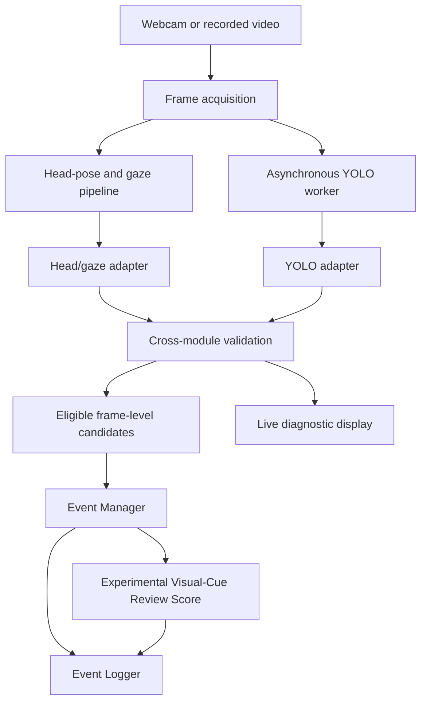
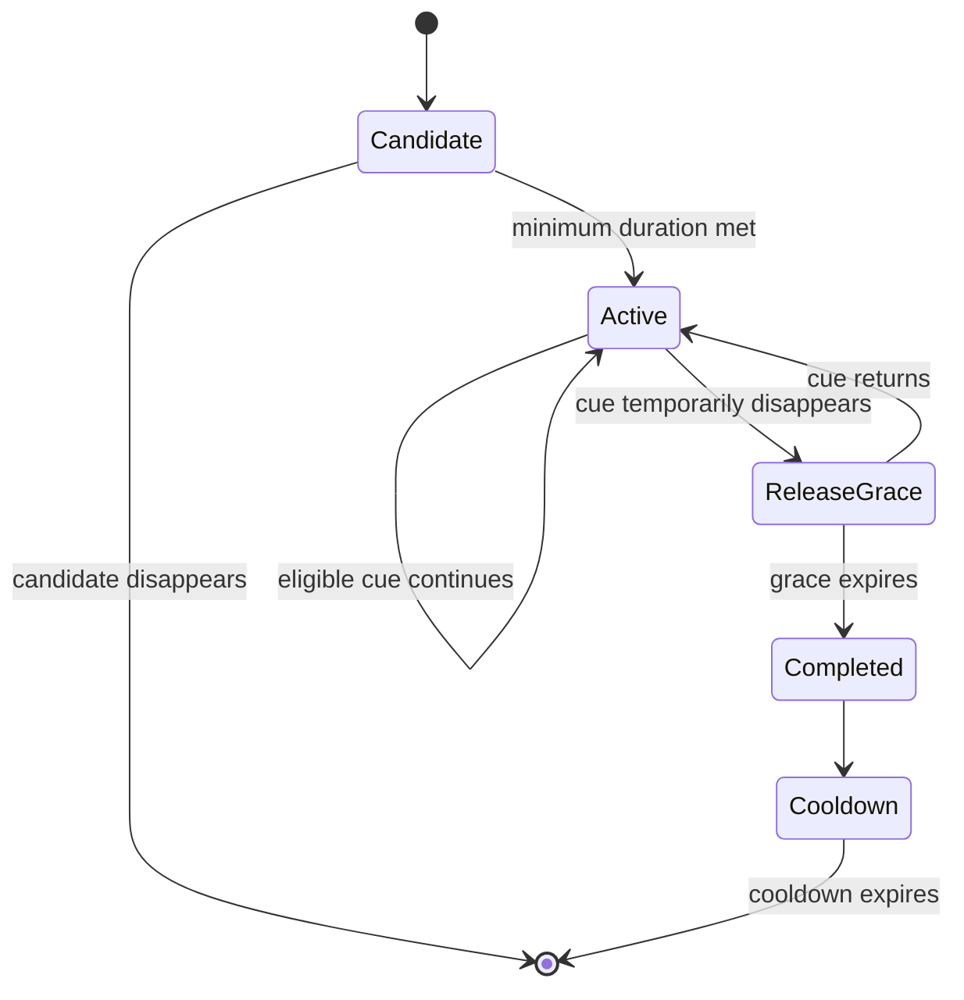

# Computer Vision Module Overview

## 1. Purpose

This document explains how the Computer Vision component is organized and how data moves between its modules. It focuses on module responsibilities, shared interfaces, and runtime interactions. Project objectives, boundaries, and responsible-use constraints are defined separately in [Project Scope](project_scope.md).

The component contains three perception modules:

1. **Person and object-cue detection**;
2. **Head-pose estimation**; and
3. **Eye-Gaze Estimation**.

Adapters, cross-module validation, event management, configurable review
scoring, and event logging combine these perception outputs into structured
review cues. They are integration components rather than additional perception
modules.

## 2. High-Level Organization

| Layer | Component | Main responsibility |
|---|---|---|
| Input | Frame acquisition | Provide webcam or recorded-video frames and timestamps |
| Perception | Object detection | Detect people and selected physical object cues |
| Perception | Head-pose estimation | Estimate calibrated head orientation |
| Perception | Gaze estimation | Estimate coarse gaze direction and eye reliability |
| Adaptation | YOLO adapter | Normalize detector labels, boxes, confidence, and result freshness |
| Adaptation | Head/gaze adapter | Expose calibrated head, gaze, and eligibility information |
| Validation | Cross-module rules | Suppress contradictory or unreliable candidate cues |
| Temporal logic | Event Manager | Convert sustained eligible cues into `START`-`ACTIVE`-`END` events |
| Review support | Experimental Visual-Cue Review Score | Summarise active confirmed cues with an auditable heuristic score |
| Output | Event Logger | Store candidate, event, review-score, and session-summary records |
| Presentation | Live interface | Display the latest diagnostic state without determining user intent |

## 3. End-to-End Data Flow



Frame-level observations are diagnostic outputs. Only eligible observations that satisfy the temporal rules can become formal events.

## 4. Perception Modules

### 4.1 Person and Object-Cue Detection

**Current approach:** OIV7-based YOLOv8s initialized from `yolov8s-oiv7.pt` and fine-tuned on OIV7-Anchor Dataset V3.

**Selected integration checkpoint:** `original_5e_best.pt`

**Base inference configuration:**

- confidence threshold: `0.25`;
- input size: `640`; and
- IoU threshold: `0.45`.

The trained model and integration interface use the following mapping:

| Model label | Integration label | Integration purpose |
|---|---|---|
| `person` | `person` | Derive normal, no-person, and multiple-person states |
| `phone` | `phone` | Represent a visible mobile-phone cue |
| `laptop` | `computer_device` | Represent the current laptop-related cue through an extensible interface |
| `book_notes` | `book_notes` | Represent books, paper, or notes |
| `calculator` | `calculator` | Represent a visible calculator cue |
| `watch` | `watch` | Represent a visible watch cue |
| `audio_device` | `audio_device` | Represent headphones, headsets, wired earphones, or earbuds |

The normalized detection record includes, where applicable:

- class identifier;
- original model label;
- integration-facing label;
- confidence score; and
- bounding box in `xyxy` coordinates.

The `computer_device` name keeps the downstream interface extensible. The current model output still maps from the trained `laptop` class; additional subtypes such as monitors would require explicit future training and validation.

Person detections are aggregated into person-state observations such as `NO_PERSON` and `MULTIPLE_PERSONS`. Object detections remain separate cues so that concurrent objects can be preserved in the event context.

### 4.2 Head-Pose Estimation

**Current approach:** MediaPipe Face Mesh, a Canonical 14-point 2D-3D correspondence configuration, and OpenCV `solvePnP`.

The module:

1. locates the required facial landmarks;
2. estimates pitch, yaw, and roll;
3. interprets the angles relative to a session-level neutral baseline; and
4. converts sustained deviations into readable directional observations.

The main integration-facing head states include a forward or neutral state and the following directional labels:

- `HEAD_LEFT`;
- `HEAD_RIGHT`;
- `HEAD_UP`; and
- `HEAD_DOWN`.

The adapter keeps the diagnostic head result separate from `head_can_trigger_event`. This allows an orientation to be displayed or logged as context even when it is not eligible to begin or continue a formal head event.

### 4.3 Reliability-Aware Gaze Estimation

**Current approach:** L2CS-Net with session-level centre-gaze calibration and passive open-eye calibration.

The module produces coarse directional categories:

- centre;
- left;
- right;
- up; and
- down.

It does not estimate an exact screen coordinate or identify the specific screen element being viewed.

Eye and landmark evidence is used to represent conditions such as:

- `EYES_OPEN`;
- `EYES_CLOSED`;
- `BLINK` or `BLINK_CANDIDATE`;
- `EYE_STATUS_UNCERTAIN`;
- `ONE_EYE_UNAVAILABLE`; and
- `PROFILE_OR_LANDMARK_UNCERTAIN`.

The integration interface separates:

- `gaze_output_available`: whether a gaze result can be exposed for display or context; and
- `gaze_deviation_event_eligible`: whether the gaze observation is reliable and sufficiently independent to contribute to a gaze-deviation event.

This distinction prevents the system from forcing an uncertain gaze estimate into an event.

## 5. Head/Gaze Relationship Handling

Head direction, eye visibility, and gaze direction are interpreted together. The shared head/gaze interface exposes four main control fields:

| Field | Meaning |
|---|---|
| `frame_is_loggable` | The frame contains sufficient information for the intended diagnostic record |
| `head_can_trigger_event` | The calibrated head observation may contribute to a head event |
| `gaze_output_available` | A gaze result may be displayed or retained as context |
| `gaze_deviation_event_eligible` | The gaze result may independently contribute to a gaze-deviation event |

The main relationship rules are:

- a reliable gaze result may remain available as supporting context while the head is turned;
- gaze following the same turned-head direction does not automatically create a second independent gaze event;
- independent gaze-deviation events require an approximately forward head and reliable eye evidence; and
- one-eye unavailability, eye closure, profile views, uncertain landmarks, or stale results can suppress gaze output or event eligibility.

These rules reduce duplicate or misleading events while preserving useful diagnostic context.

## 6. Asynchronous YOLO Runtime

YOLO inference runs in a background latest-frame worker because CPU object detection is slower than the head-pose, gaze, interface, and event-processing loop.

The worker keeps only the latest submitted frame instead of building a long inference queue. Each result includes information that allows the runtime to distinguish:

- a fresh inference result;
- a reused most-recent result;
- the associated frame or sequence identifier;
- the inference timestamp and result age; and
- whether the result is considered fresh or stale for temporal use.

A reused result may remain visible in the interface, but it is not treated as a new temporal observation. This prevents a single YOLO inference from being counted repeatedly merely because the interface runs faster than the detector.

## 7. Cross-Module Validation

Cross-module validation resolves selected contradictions before candidates reach the Event Manager.

Implemented examples include:

- suppressing a YOLO `NO_PERSON` candidate when the head/gaze pipeline still provides valid face evidence;
- separating head events from gaze events that represent the same overall movement;
- preventing unreliable gaze states from triggering independent gaze events; and
- retaining simultaneous cues as context and, separately, exposing them to an
  auditable heuristic review score rather than an automatic cheating verdict.

Cross-module rules are intentionally limited to cases where the available evidence supports a clear relationship. They do not infer motivation or intent.

## 8. Event Manager

The Event Manager converts eligible frame-level candidates into temporal events. Depending on the cue configuration, it applies:

- confidence or eligibility requirements;
- minimum-duration confirmation;
- release-grace handling for brief interruptions;
- cooldown behaviour; and
- occurrence counting.

The event lifecycle is:



Logger-facing event records use `START`, `ACTIVE`, and `END` states. Module-specific thresholds belong in configuration documentation rather than being duplicated across runtime code and overview documents.

The finalized conservative `audio_device` event rule currently uses:

- event-eligibility confidence: `0.43`;
- minimum duration: `0.75 s`;
- release grace: `0.60 s`; and
- cooldown: `0.50 s`.

## 9. Experimental Visual-Cue Review Score

The review-score module processes only currently observed, temporally confirmed
cues. For cue `i`, its contribution is:

```text
C_i = W_i x F_confidence,i x F_duration,i
```

The configured duration factor is:

```text
F_duration,i = F_floor + (1 - F_floor) x min(T_i / T_reference, 1)
```

and the current score is:

```text
S_t = min(1, sum(C_i) + B(D))
```

where `W_i` is the cue weight, `F_confidence,i` is its confidence factor,
`T_i` is the cue's current confirmed duration, `T_reference` is the duration at
which the duration factor reaches its cap, `F_floor` is the minimum duration
factor, and `B(D)` is the configured bonus for the number of concurrently
active cue domains. The v1.1 configuration uses `F_floor = 0.80` and
`T_reference = 5 s`.

Duplicate detections of the same cue contribute once. Release-grace, stale,
filtered, and completed cues do not contribute. The current score and session
peak are recorded separately. The score is an experimental prioritisation aid,
not a calibrated probability of cheating.

## 10. Event Logger and Outputs

The Event Logger preserves traceable records for later evaluation and review. Depending on the run configuration, its outputs include:

- filtered frame-level candidates in `filtered_candidates.jsonl`;
- lifecycle records in `events.jsonl`;
- completed events in `completed_events.csv`;
- per-frame review-score breakdowns in `review_scores.jsonl`;
- timestamps and event durations;
- occurrence counts;
- confidence and sample statistics where applicable;
- concurrent cues from the other modules; and
- a session-level summary in `session_summary.json`, including review-level
  sample counts and session peak score where scoring is enabled.

The logger records observations and events rather than an automatic cheating verdict.

## 11. Module Interface Summary

| Producer | Main output | Primary consumer |
|---|---|---|
| Object detector | Raw boxes, model labels, and confidence | YOLO adapter |
| YOLO adapter | Normalized detections, person state, freshness metadata | Cross-module validation and Event Manager |
| Head-pose estimator | Calibrated angles and head direction | Head/gaze adapter |
| Gaze estimator and eye-reliability logic | Coarse gaze, confidence, and reliability state | Head/gaze adapter |
| Head/gaze adapter | Diagnostic outputs and event-eligibility fields | Cross-module validation and Event Manager |
| Cross-module validation | Eligible and suppressed candidates with context | Event Manager and live display |
| Event Manager | Event lifecycle updates and completed events | Event Logger |
| Event Manager | Currently observed confirmed cues | Experimental Visual-Cue Review Score |
| Review-score module | Current score, per-cue breakdown, level, and session peak | Event Logger and live display |
| Event Logger | JSONL, CSV, review-score, and session-summary artifacts | Evaluation, review, reporting, and handover |

## 12. Current Status

Implemented and tested:

- the three perception modules;
- head/gaze and YOLO adapters;
- reliability and eligibility separation;
- cross-module `NO_PERSON` validation;
- asynchronous latest-frame YOLO inference;
- temporal event management; and
- structured event logging;
- externally configured Experimental Visual-Cue Review Score v1.1; and
- synthetic score and logger-compatibility checks.

Handover items not present in the archive audited on 20 August 2026:

- the filled formal trial log and reviewed final result tables;
- the final consolidated limitations document;
- final architecture source/export files; and
- confirmation of the exact approved L2CS-Net commit and clean-machine smoke
  test.

Detailed algorithms, experiments, numerical results, and limitations are maintained in their respective methodology, experiment, results, and limitations documents.
