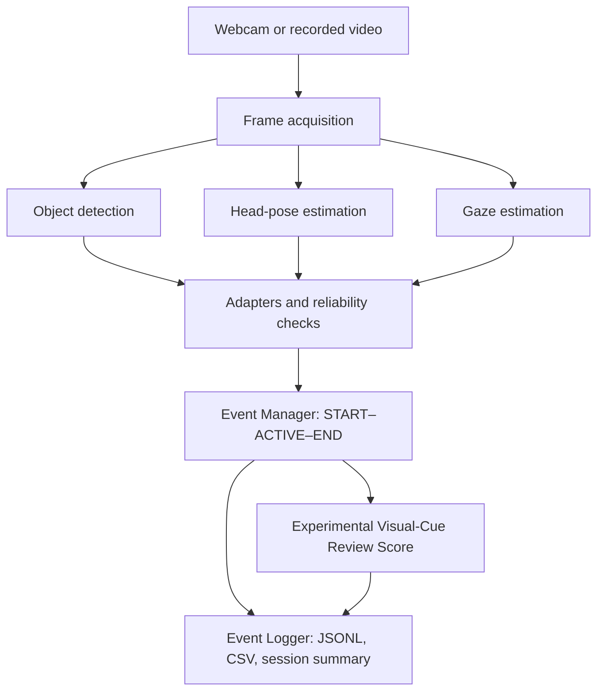

# Project Scope

## 1. Project Context

This repository contains the webcam-based Computer Vision component of an online-assessment monitoring prototype. The broader project combines two complementary evidence channels:

1. webcam-based analysis of the examinee and the visible physical environment; and
2. screen-content monitoring and analysis implemented outside the Computer Vision component.

The Computer Vision component detects and records observable visual cues that may require later review. It does **not** independently determine whether a student is cheating, assign guilt, calculate a cheating score, or make disciplinary decisions.

## 2. Project Objective

The main objective is to develop a reliability-aware webcam pipeline that can:

- detect selected people and physical object cues;
- estimate calibrated head direction;
- estimate calibrated, coarse eye-gaze direction;
- reject or suppress unreliable gaze evidence;
- combine the three perception modules through consistent frame-level interfaces;
- convert sustained eligible cues into structured events; and
- preserve timestamps, durations, confidence information, reliability states, and concurrent-cue context for subsequent human review and research analysis; and
- provide an interpretable Experimental Visual-Cue Review Score for prioritising
  intervals without treating the score as a probability or verdict.

## 3. Computer Vision Architecture

The Computer Vision component contains **three main perception modules**:

1. **Person and object-cue detection**
2. **Head-pose estimation**
3. **Eye-Gaze Estimation**

Their outputs are combined by the integration and event-processing layer:

The Event Manager, Event Logger, and review-score module are integration
components rather than additional perception modules.

## 4. Scope of the Three Perception Modules

### 4.1 Person and Object-Cue Detection

The current object detector is initialized from `yolov8s-oiv7.pt`, an OIV7-pretrained YOLOv8s checkpoint, and fine-tuned using the selected **OIV7-Anchor Dataset V3**.

The trained detector uses seven model classes. The integration adapter exposes a stable seven-class interface:

| Class ID | Model label | Integration label | Included examples |
|---:|---|---|---|
| 0 | `person` | `person` | examinee or additional visible person |
| 1 | `phone` | `phone` | mobile phone |
| 2 | `laptop` | `computer_device` | laptop computer |
| 3 | `book_notes` | `book_notes` | book, paper, or notes |
| 4 | `calculator` | `calculator` | calculator |
| 5 | `watch` | `watch` | wristwatch or similar watch |
| 6 | `audio_device` | `audio_device` | headphones, headsets, wired earphones, or earbuds |

`computer_device` is the integration-facing name for the trained `laptop` class. The broader interface name was chosen to keep the integration schema extensible, so a future detector could add explicitly trained and validated computer-device subtypes such as monitors without changing the downstream event interface. In the current model, however, `computer_device` should still be interpreted as the mapped output of the `laptop` class rather than as a general detector for all computer equipment.

Person detections support states such as `NO_PERSON` and `MULTIPLE_PERSONS`. The other six classes represent physical cues that may be relevant during later assessment review.

This module's scope includes dataset selection and documentation, class normalization, dataset cleaning and construction, transfer learning, checkpoint comparison, fixed-image and recorded-video evaluation, live-webcam verification, failure analysis, and conversion of detector outputs into the shared integration schema.

### 4.2 Head-Pose Estimation

The head-pose module estimates whether the examinee's head is oriented forward, left, right, up, or down. It uses:

- MediaPipe Face Mesh facial landmarks;
- a Canonical 14-point 2D-3D landmark correspondence configuration; and
- OpenCV `solvePnP` to estimate pitch, yaw, and roll.

A neutral forward-facing baseline is established at the beginning of a monitoring session. Subsequent head movements are interpreted relative to this calibrated baseline and exposed as directional cues such as `HEAD_LEFT`, `HEAD_RIGHT`, `HEAD_UP`, and `HEAD_DOWN`.

The scope includes public-dataset evaluation, structured webcam trials, calibration, temporal stability checks, known pose-flip analysis, and output through the integration interface. Head direction is treated as an observable cue rather than proof of user intent.

### 4.3 Eye-Gaze Estimation

The gaze module uses L2CS-Net to estimate coarse gaze directions such as centre, left, right, up, and down. It does not attempt precise point-of-gaze or screen-coordinate tracking.

The implemented pipeline includes:

- session-level centre-gaze calibration;
- passive open-eye calibration;
- eye-aspect-ratio and eye-status checks;
- handling of blinking, eye closure, one-eye unavailability, profile views, and uncertain landmarks; and
- separation of gaze-output availability from gaze-event eligibility.

This separation allows a gaze estimate to remain available for display or contextual logging while preventing an unreliable observation from independently generating a gaze-deviation event. Independent gaze events are restricted to eligible conditions, including sufficiently reliable eye evidence and an approximately forward-facing head.

The scope includes public-dataset evaluation, structured directional trials, calibration analysis, reliability and coverage measurement, and integration with head-pose context.

## 5. Multi-Module Integration and Event Processing

The three perception modules are combined into one live webcam prototype. Standardized adapters expose consistent frame-level results to the integration layer.

The Event Manager applies cue eligibility rules, confidence requirements, minimum-duration thresholds, release-grace periods, and cooldown behaviour. A brief or unstable frame-level prediction therefore does not immediately become a formal event.

Recorded events follow a `START`-`ACTIVE`-`END` lifecycle. The Event Logger preserves completed-event information, including:

- event type and status;
- start and end timestamps;
- duration;
- confidence and sample statistics where applicable;
- concurrent cues from other modules; and
- session-level summaries in structured formats such as JSONL and CSV.

Cross-module validation is used where one module can provide relevant supporting evidence for another. For example, a YOLO `NO_PERSON` observation can be suppressed when the head/gaze pipeline still provides valid face evidence. Head and gaze outputs are also interpreted together so that unreliable or strongly related observations do not automatically create misleading duplicate events.

The runtime uses asynchronous latest-frame object detection so that slower YOLO inference does not block the head-pose, gaze, event-management, logging, and interface pipeline.

The Experimental Visual-Cue Review Score operates only on currently active,
temporally confirmed cues. It combines configured cue weights, confidence and
duration factors, and a cross-domain concurrency bonus. It preserves a full
per-cue breakdown for audit and must not be presented as a calibrated
probability of misconduct.

## 6. Evaluation Scope

The project uses several complementary evaluation protocols:

| Evaluation type | Purpose |
|---|---|
| Public-dataset evaluation | Evaluate head-pose and gaze methods on established datasets |
| Controlled object-detection validation | Compare dataset changes, checkpoints, thresholds, and class-level behaviour |
| Structured webcam trials | Test calibration, directional behaviour, reliability rules, and temporal stability |
| Recorded-video validation | Compare checkpoints and examine temporal detections and practical failure cases |
| Live-webcam verification | Check usability and behaviour in the intended prototype setting |
| End-to-end event evaluation | Measure expected events, missed events, false alerts, timing, multi-cue behaviour, and logging consistency |

Results from these protocols are reported separately because they use different datasets, tasks, participants, annotations, and evaluation conditions. Controlled checkpoint-comparison results are not presented as general production-level accuracy.

## 7. Expected Outputs

The Computer Vision work is expected to produce:

- organized runtime and evaluation code;
- documented datasets, class mappings, model sources, configurations, and limitations;
- reproducible environment and setup guidance;
- module-level and end-to-end evaluation protocols and results;
- structured frame-level and event-level outputs;
- selected anonymized examples, figures, and result tables;
- progress, methodology, result, and final-summary documentation; and
- setup, usage, reproducibility, and handover guidance.

The intended users are the internship supervisor, collaborating researcher, future project maintainers, and authors preparing related research documentation or a manuscript.

## 8. Out of Scope

The following items are outside this Computer Vision scope:

- making a definitive cheating judgement;
- automated disciplinary action or calibrated cheating-probability scoring;
- identity recognition or long-term biometric identification;
- emotion-based conclusions about suspicious behaviour;
- precise point-of-gaze or screen-coordinate tracking;
- keystroke, mouse, microphone, or audio-content monitoring;
- browser-tab switching, translation-tool use, browser-extension detection, or other screen/browser activity analysis;
- LLM-based analysis and non-CV monitoring modules owned by collaborators;
- production deployment, institutional policy enforcement, or legal-compliance certification; and
- large-scale cross-participant validation beyond the available internship data and schedule.

The complete system may combine the structured Computer Vision events with screen-monitoring evidence, but those external components are not designed or implemented within the `computer_vision/` folder.

## 9. Data and Repository Boundaries

The repository is intended to contain organized, shareable, and reproducible project materials. It excludes:

- raw datasets that cannot be redistributed;
- identifiable private webcam images or videos;
- original Daily Worklogs;
- temporary outputs, debug logs, and redundant training artifacts;
- complete local Conda environment folders;
- machine-specific absolute paths, credentials, and private configuration;
- outdated or duplicate checkpoints; and
- third-party model files that are not intended for redistribution.

Where a model or dataset cannot be included, its source, version, mapping, and
access instructions should be documented. Ordinary Git tracking of `.pt`,
`.pkl`, and `.task` model assets is prohibited by the module `.gitignore`.
Required frozen assets are distributed through the approved project handover
channel and verified using the filenames, sizes, and SHA-256 values recorded in
[`../models/README.md`](../models/README.md).

## 10. Responsible-Use Boundary

All detections and events must be interpreted as cues for human review. A phone detection, head turn, gaze deviation, additional person, or other object cue may have a legitimate explanation. Model errors, camera angle, lighting, occlusion, individual behaviour, and dataset limitations must be considered before interpreting an output.

The system therefore supports transparent review through confidence values, timestamps, reliability states, event durations, and multi-cue context rather than presenting an unsupported behavioural conclusion.

## 11. Current Scope Status

As of the combined-branch audit on 20 August 2026:

- the three perception modules and frozen integration runtime are implemented;
- `original_5e_best.pt` remains the selected global integration checkpoint;
- adapters, reliability checks, cross-module validation, asynchronous YOLO,
  temporal event management, audit logging, and configurable review scoring are
  represented in the combined branch;
- the external score configuration and two dependency-light synthetic tests
  are tracked;
- environment, model-access, integrity, runtime, evaluation-protocol, and
  handover guidance are tracked; and
- the final presentation has been completed, while repository consolidation and
  final evidence handover remain in progress.

The audited archive includes the final protocol and a blank 90-trial template,
but it does not include the filled master log, reviewed result tables, final
limitations summary, or final architecture source files. Their absence from
the archive must not be interpreted as evidence that the corresponding work
was not performed. Add only reviewed and anonymized canonical artifacts.

This file defines the project boundary and current high-level architecture.
Detailed numerical results, experiment procedures, implementation parameters,
and known failure cases belong in the relevant methodology, evaluation,
results, configuration, and limitations documents.
